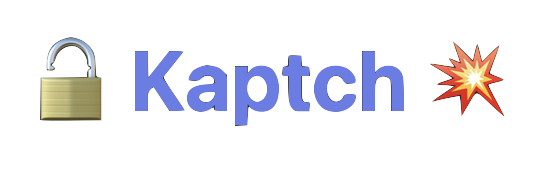
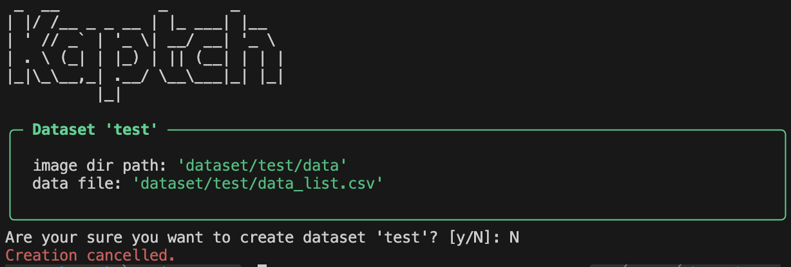
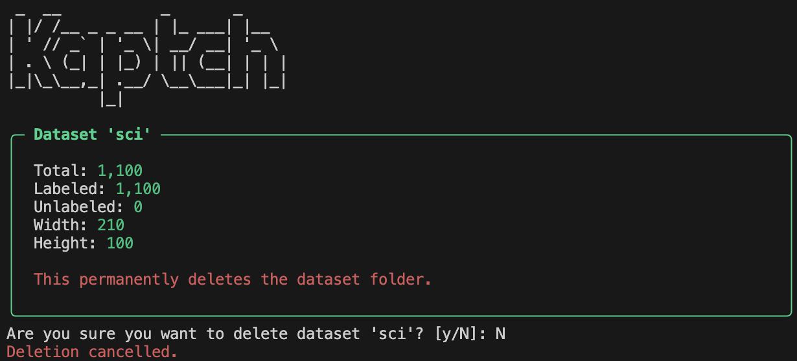
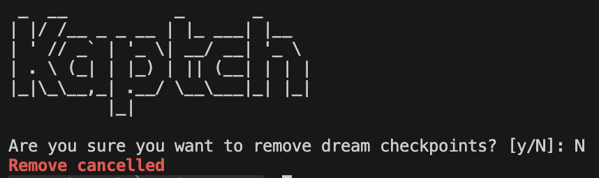

<br/>
<div align="center">
  
  
</div>
<br/>

Kaptch는 한국 모바일인증 서비스의 캡챠를 자동으로 인식하는 AI모델을 만들기 위한 CLI도구 입니다. Kaptcha는 데이터를 수집에서 모델을 만드는 과정까지 필요한 명령어를 CLI에서 조작할 수 있도록 합니다.

## 🔧 기술 스택


## 🚀 주요 기능

- **자동 데이터 수집**: Playwright를 사용한 웹 크롤링
- **웹 기반 라벨링**: 브라우저를 통한 편리한 라벨링 인터페이스
- **모델 훈련**: CRNN 모델을 사용한 캡챠 인식 훈련
- **체크포인트 관리**: 훈련 과정의 체크포인트 저장 및 관리
- **ONNX 변환**: 추론 최적화를 위한 ONNX 모델 변환


## 📊 모델 아키텍처

- **CNN**: 이미지 특징 추출
- **RNN**: 시퀀스 모델링 (Bidirectional GRU)
- **CTC Loss**: 가변 길이 출력 처리
- **Early Stopping**: 과적합 방지
- **Learning Rate Scheduling**: 최적화 성능 향상

## 📖 사용방법

### 🚀 시작하기

```bash
# 프로젝트 실행
python main.py

# 도움말 보기
python main.py --help
```

### 📊 데이터셋 관리

```bash
# 데이터셋 목록 보기
python main.py datasets list
python main.py datasets ls

# 새 데이터셋 생성
python main.py datasets create <데이터셋명>
python main.py datasets add <데이터셋명>

# 웹에서 캡챠 이미지 수집
python main.py datasets crawl <데이터셋명> --goal 1100 --debug

# 웹 기반 라벨링 서버 시작
python main.py datasets label --host localhost --port 3000

# 데이터셋 삭제
python main.py datasets remove <데이터셋명>
python main.py datasets rm <데이터셋명>
```

#### 데이터셋 목록 보기


#### 새 데이터셋 생성


#### 데이터셋 삭제


### 🧠 모델 훈련

```bash
# CRNN 모델 훈련
python main.py train <데이터셋명>

# 훈련 옵션 설정
python main.py train <데이터셋명> \
  --batch-size 32 \
  --epochs 50 \
  --learning-rate 2e-3 \
  --patience 5 \
  --train-size 1000 \
  --test-size 100 \
  --seed 42 \
  --warmup-epochs 5
```

### 💾 체크포인트 관리

```bash
# 체크포인트 목록 보기
python main.py checkpoints list <데이터셋명>
python main.py checkpoints ls <데이터셋명>

# 모든 데이터셋의 체크포인트 보기
python main.py checkpoints list all

# 체크포인트 삭제
python main.py checkpoints remove <데이터셋명>
python main.py checkpoints rm <데이터셋명>
```

#### 체크포인트 목록 보기


#### 체크포인트 삭제


### 🔧 기타 유틸리티

```bash
# PyTorch 모델을 ONNX로 변환
python main.py misc torch2onnx <데이터셋명> <체크포인트명> --output captcha.onnx

# ONNX 모델 검증 (숨겨진 명령어)
python main.py misc validate <데이터셋명> <체크포인트명> --image-path <이미지경로>
```

#### PyTorch 모델을 ONNX로 변환


### 📝 사용 예시

```bash
# 1. 데이터셋 생성 및 수집
python main.py datasets create sci
python main.py datasets crawl sci --goal 1000

# 2. 웹 라벨링으로 데이터 라벨링
python main.py datasets label
# 브라우저에서 http://localhost:3000 접속

# 3. 모델 훈련
python main.py train sci --epochs 100 --batch-size 64

# 4. 체크포인트 확인
python main.py checkpoints list sci

# 5. ONNX 변환
python main.py misc torch2onnx sci ep10.pkl my-model.onnx
```


<div align="center">
  <a href="/docs/comment.md">개발자 코맨트</a><br/>
  아무거나 규탄한다! 이것저것 보장하라!
</div>